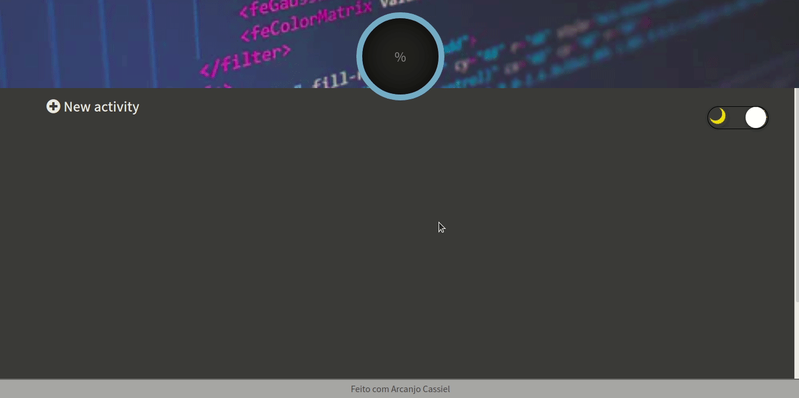

<h1 align="center"> list_actividad</h1>

#### Created using JavaScript
##  🔥 Install

## Execute:

```shell


#Cloning repo

$ git clone <https://github.com/Arcanjo32cassiel/list_actividad.git>

#Install dependencies 
  $ npm
  
#Run project

  $ npm start
```
## Image
<div align="center"></div>
